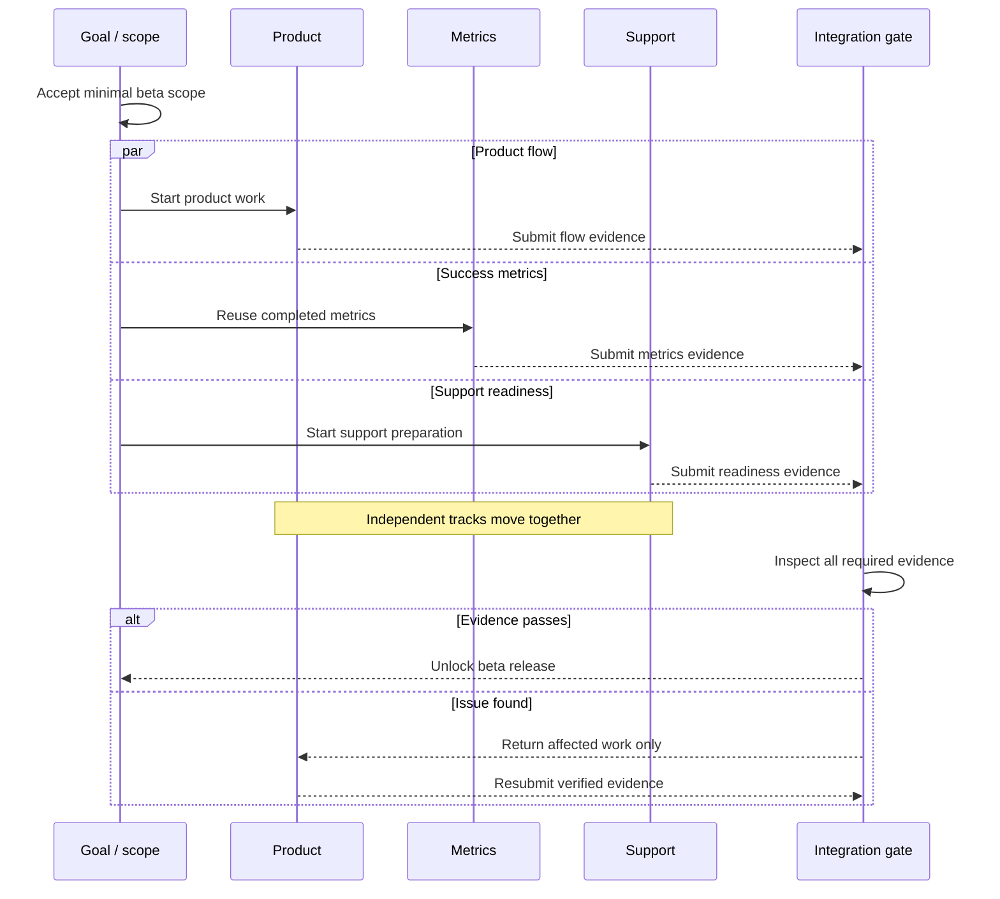

# Track

Track is a lightweight, human-guided orchestration skill for complex work. It
keeps the goal stable while tasks, dependencies, tracks, and working sessions
change around it.

**Version:** 0.1.8
**Codex skill:** `$track`

[Open the English landing page](index.html) · [한국어 랜딩 페이지](index.ko.html) · [Read the skill instructions](SKILL.md)

## What Track does

- preserves the original goal while the execution plan evolves;
- separates sequential dependencies from work that can safely run in parallel;
- applies a small over-engineering gate before adding work or expanding scope;
- treats tracks as stable workstreams and sessions as replaceable resources;
- accepts progress only after inspecting outputs and verification evidence;
- keeps one development map current instead of producing disconnected plans.

Use Track for multi-stage product work, research programs, migrations, or any
project where several workstreams must meet at shared gates. A simple one-step
task usually does not need it.

## Track example: ship an onboarding beta

Ask Codex:

> Use `$track` to coordinate the onboarding beta. Reuse the product work that
> already exists, split independent work, keep one development map, and stop
> at a verified beta release.

Track shows independent work as parallel lanes, then makes each handoff and
shared gate visible on the same timeline:



The goal stays fixed in the first lane. Three tracks progress independently and
hand their evidence to the integration gate, but the beta remains locked until
all required evidence arrives. If a problem appears, Track returns only the
affected work instead of restarting the whole plan. Sessions may be reassigned
without changing these workstream lanes.

Mermaid is the default visualization. Track uses an ASCII fallback only when
Mermaid cannot render or plain text is explicitly required.

## Workflow

1. Establish the goal, constraints, definition of done, and observed state.
2. Reuse existing decisions and completed artifacts before creating new work.
3. Decompose the goal into inspectable outcomes and draw their dependencies.
4. Pass each new task, session, or scope expansion through the
   over-engineering gate.
5. Assign bounded work with an output, acceptance condition, and stopping
   point.
6. Inspect evidence, update the living map, and unlock dependent work.
7. Finish when the acceptance conditions are met, or revise the same map when
   the goal changes.

## Install

Place this repository in your Codex skills directory:

```bash
mkdir -p ~/.codex/skills
cp -R /path/to/track ~/.codex/skills/track
```

Then start a Codex task with a request such as:

```text
Use $track to turn this project into a living development map and coordinate it to completion.
```

## Repository contents

```text
track/
├── SKILL.md               # operational instructions for Codex
├── agents/openai.yaml     # skill-list metadata
├── README.md              # public orientation and example
├── VERSION                # current public version
└── index.html             # standalone landing page
```

## Boundaries

Track is a coordination method, not a project-management backend. It does not
create idle sessions for every component, automate staffing, or expand the
project to solve hypothetical future problems. It keeps deferred ideas visible
without presenting them as active commitments.
