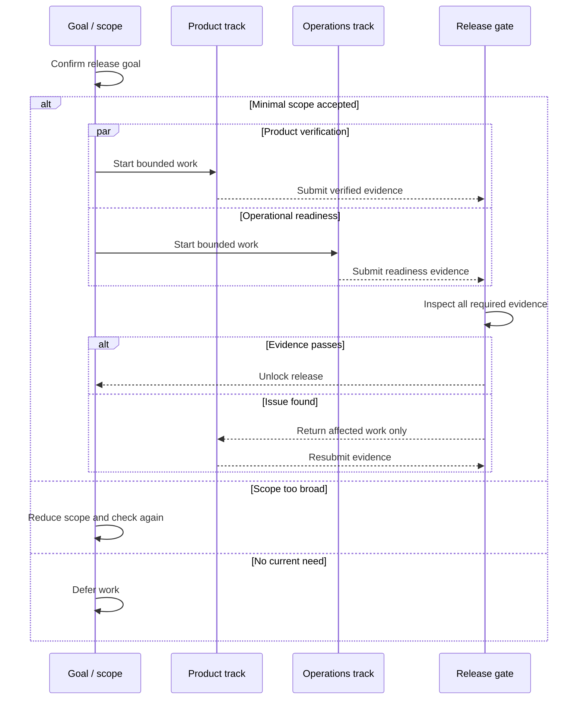

# TRACK

Map the work. Track it to done.

## Core rules

1. Preserve the goal over the initial plan, task list, or session lineup.
2. Inspect and reuse existing plans, decisions, artifacts, and completed work before creating anything new.
3. Keep one living development map as the source of truth. Update it instead of producing disconnected plans.
4. Keep internal records precise and structured. Translate them into plain language when communicating with the user.
5. Treat tracks as relatively stable workstreams and sessions as replaceable execution resources.
6. Inspect results and resolve routine coordination issues before asking the user. Escalate only decisions that materially affect goal, scope, cost, risk, or product direction.
7. Apply the over-engineering gate before adding a task, creating a session, or expanding scope.

## Workflow

### 1. Establish the goal and current state

- Read the user's goal, requested outcome, constraints, and definition of done.
- Inspect the repository, existing development map, decisions, active work, and completed artifacts when available.
- Do not restart a project merely because its current organization is imperfect.
- Separate known facts, reasonable assumptions, and decisions that genuinely require the user.
- Ask a question only when the answer cannot be discovered and a reasonable assumption would materially change the result.

### 2. Decompose the work

- Split the goal into outcome-oriented stages.
- Split each stage into tasks that produce one inspectable result.
- Keep tasks large enough to matter and small enough to verify.
- Record only coordination information that affects execution. Internally, use stable fields such as:
  - track and task identifiers;
  - goal relationship;
  - dependencies;
  - current session assignment;
  - expected output;
  - acceptance condition;
  - stop condition;
  - gate decision;
  - status and verification evidence.
- Do not expose identifiers or internal field names to the user unless they aid a decision or the user requests the precise record.

### 3. Build the development map

- Draw dependencies before assigning sessions.
- Distinguish work that must happen in sequence from work that can safely proceed in parallel.
- Create a separate track only when the work can progress independently, benefits from focused context, and produces a clear handoff.
- Keep tightly coupled work together when splitting would create more coordination than progress.
- Show the smallest useful visualization. Always start with Mermaid. Use ASCII only as a fallback when Mermaid cannot render in the current surface or its rendering has failed.
- Make the current focus, active work, completed work, next unlock, and deferred work recoverable from the map alone.

### 4. Apply the over-engineering gate

Check every new task, session, and scope expansion:

1. Does it directly help the original goal?
2. What current sample, user need, or observed problem requires it now?
3. What existing result can be reused?
4. Can a smaller experiment provide the same learning?
5. Is the proposed level appropriate for current usage and evidence?
6. Can the stopping point and deferred work be stated clearly?

Record one decision internally:

- `pass` — proceed at the proposed minimal scope;
- `reduce` — shrink the work, then proceed;
- `hold` — keep it visible but do not execute it now.

Explain the decision to the user in their language and in ordinary words. Do not turn the gate into a long ceremony for routine work.

### 5. Assign and adapt sessions

- Treat the initial session layout as a hypothesis, not a permanent organization chart.
- Do not create idle sessions merely to mirror every stage or component.
- Keep the current session when it has the right context and is progressing well.
- Split work when independent tasks can produce useful results in parallel.
- Merge work when sessions repeatedly need the same context or decisions.
- Replace a session when the required expertise or work character changes substantially, its context has become misleading, or repeated attempts fail for the same reason.
- Pause or close a session when its work is blocked, deferred, or complete.
- Reconsider the layout after a meaningful result, a blockage, a phase transition, or a clear quality problem—not after every small update.
- Change the layout only when the expected gain exceeds the handoff cost.
- When sessions share a workspace, give them non-overlapping file or artifact ownership whenever practical.

When handing work to another session, pass only the necessary packet:

- original goal;
- completed work;
- accepted decisions;
- current artifacts and their locations;
- unresolved issues;
- next task and acceptance condition;
- work that must not be repeated or expanded.

### 6. Follow the work

- Start tasks whose dependencies are satisfied and whose gate decision permits execution.
- Give each session a bounded request with its expected output, acceptance condition, reused inputs, and explicit non-goals.
- Inspect a session's evidence and artifacts before accepting its status.
- Verify results in proportion to risk using relevant tests, visual checks, diffs, or source inspection.
- Update the development map immediately after a meaningful status, dependency, decision, or assignment change.
- If new work appears, return it through the gate instead of allowing silent scope expansion.
- Resolve routine failures, stale assumptions, and session coordination directly when they remain within the user's authority and project scope.
- Ask the user only when a missing choice would materially change the result or require new authority.

### 7. Finish or re-plan

- Mark work complete only when its output and acceptance condition are both satisfied.
- Close or release sessions that no longer have useful work.
- Confirm that the final result still serves the original goal.
- Preserve deferred ideas without presenting them as active commitments.
- If the goal changes, revise the existing map and explain the change instead of silently replacing the plan.

## Development map conventions

- Reuse an existing source-of-truth plan when one exists.
- If no plan exists and project writes are authorized, create one project-local development map at a clear path.
- Maintain stable internal status values for machine reasoning, but communicate them in the user's language.
- In Korean communication, use `[진행 중]` and `[완료]` for actual work state. Use `[현재 논의 중]` only for the current conversational focus. Explain blocked or deferred work in a sentence rather than inventing many user-facing labels.
- Never claim a task is active or complete without checking the available evidence.
- Keep history only when it helps recover a decision; keep the current map easy to scan.

## Visualization conventions and examples

- Use Mermaid as the default chart format whenever a visualization materially improves the map. Do not choose ASCII merely for convenience or personal preference.
- Prefer `sequenceDiagram` when several workstreams move in parallel, hand off evidence, and converge at a shared gate. Its participant lanes should make both ownership and time order visible. Use `flowchart` when dependency topology is the main point and a time axis would add noise.
- Keep node labels short. Put acceptance details, evidence, and exceptions in nearby prose instead of crowding the chart.
- Reflect verified state in the chart with the same user-facing status language used in the development map.
- Do not emit a duplicate ASCII chart after a working Mermaid chart. Provide the ASCII fallback only when Mermaid is unavailable, fails to render, or the user explicitly needs plain text.
- Preserve the important topology in the fallback: sequence, parallel work, gates, blocked paths, and the next unlock. It may omit decorative or low-value detail.

Default Mermaid example for a release-readiness project:



ASCII fallback for the same map:

```text
[Confirm release goal]
          |
          v
[Scope gate]
  |-- minimal scope accepted --> [Prepare release candidate]
  |-- too broad ----------------> [Reduce scope] --> [Scope gate]
  `-- no current need ----------> [Defer]

[Prepare release candidate]
  |-- Product verification ------\
  `-- Operational readiness ------+--> [Release gate]
                                      |-- evidence passes --> [Release]
                                      `-- issue found -----> [Return to owning track]
                                                                  |
                                                                  `--> [Prepare release candidate]
```

## Communication

- Lead with the current outcome or state, then explain the next move.
- Translate internal names into plain language. Preserve exact internal terms in the record for reliable reasoning and handoffs.
- Tell the user what is happening now, what was verified, what comes next, and what decision—if any—is needed from them.
- Do not require the user to read internal logs, identifiers, or session mechanics to understand progress.
- Prefer one necessary question over a list of speculative choices.

## Version 1 boundaries

- Do not build a project-management backend, automatic scheduler, dashboard, scoring system, or performance metric system.
- Do not automate session rebalancing; apply the rules with judgment.
- Do not multiply tracks or sessions for a small one-step task.
- Do not redo completed work merely to fit this workflow.
- Do not pre-solve hypothetical scale, security, or operational problems without observed need.
- Add automation only after repeated real projects reveal a stable, reusable operation.

## Final self-check

Before reporting progress, confirm:

- the map still reflects the original goal;
- completed work was reused;
- serial and parallel work are distinguishable;
- Mermaid was used as the default visualization, with ASCII only when fallback conditions applied;
- each active task has an owner, output, acceptance condition, and stopping point;
- the current session layout is still useful;
- new scope passed the gate;
- the map matches observed reality;
- the user is being asked only for a decision that is truly theirs.
